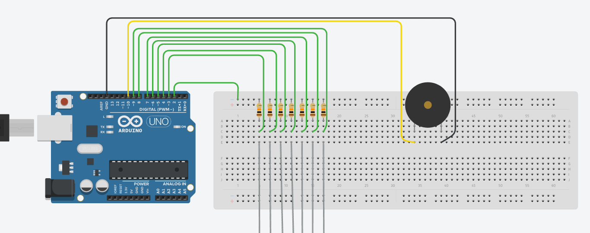

# Capacitive Keyboard
Teclado musical feito com Arduino e sensores capacitivos, utilizando folhas de papel alumínio como material primário.

<h2>Esquema </h2>

<h2>Foto do projeto em exposição no Hackpuc 2017</h2>

